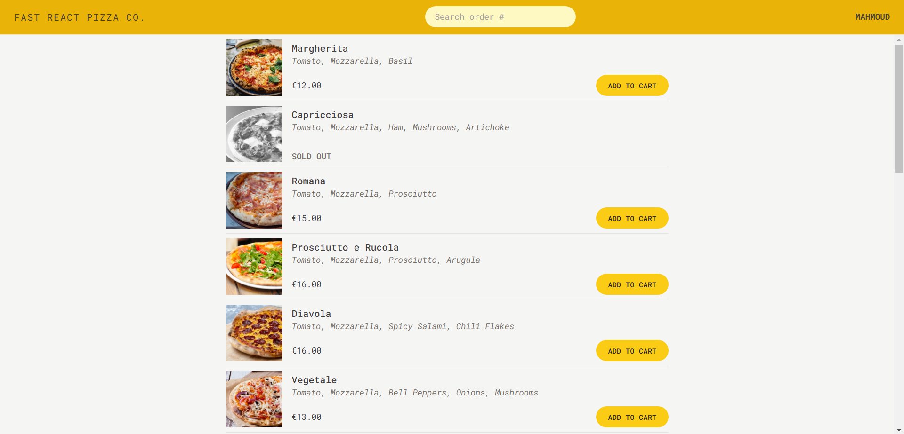

# FAST REACT PIZZA

> A delivery pizza restaurant website.

</img>

## Try it Live!

Check out the live app [FAST REACT PIZZA](https://fast-react-pizza-demo.vercel.app/)

## Tools and Libraries Used

- React
- TailwindCSS
- @reduxjs/toolkit
- react-redux
- react-router-dom
- Vite

## Getting Started

1. Clone this repository.

   ```bash
   git clone https://github.com/mahmoud-mohsen-dev/fast-react-pizza.git
   ```

2. Navigate to the Project Directory:
   ```bash
   cd fast-react-pizza
   ```
3. Install Dependencies:

   ```bash
    npm install
   ```

4. Start the Development Server:

   ```bash
   npm run dev
   ```

5. Open in your Browser:

   Open your web browser and go to http://localhost:3000 to see the app in action.

Now you have the "FAST REACT PIZZA" app up and running on your local machine.

_This poject was part of The Ulitmate React Couse_
